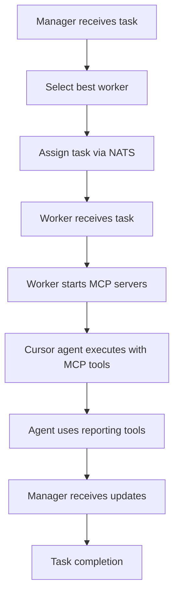

# MCP Enhanced Worker System - Complete Documentation

## 🚀 Overview

The **MCP Enhanced Worker System** is a comprehensive distributed task execution platform with advanced analytics, real-time monitoring, and bidirectional communication between managers and workers. This system enables workers to report detailed telemetry data back to managers through MCP (Model Context Protocol) tools.

## 📋 Table of Contents

1. [Architecture](#architecture)
2. [Key Components](#key-components)
3. [Enhanced Features](#enhanced-features)
4. [MCP Worker Tools](#mcp-worker-tools)
5. [MCP Manager Tools](#mcp-manager-tools)
6. [Workflow](#workflow)
7. [Installation & Setup](#installation--setup)
8. [Usage Examples](#usage-examples)
9. [Analytics & Monitoring](#analytics--monitoring)
10. [API Reference](#api-reference)

---

## 🏗️ Architecture

```
┌─────────────────────────────────────────────────────────────────────┐
│                         MCP MANAGER ENHANCED                         │
│  ┌─────────────────────────────────────────────────────────────┐   │
│  │ Analytics Engine │ Task Orchestrator │ Real-time Monitor    │   │
│  └─────────────────────────────────────────────────────────────┘   │
│                               ↕️ NATS                               │
│  ┌─────────────────────────────────────────────────────────────┐   │
│  │         PostgreSQL        │        Redis Cache              │   │
│  └─────────────────────────────────────────────────────────────┘   │
└─────────────────────────────────────────────────────────────────────┘
                                  ↕️
                            NATS Message Bus
                     ↙️              ↓              ↘️
    ┌──────────────────┐ ┌──────────────────┐ ┌──────────────────┐
    │  UNIFIED WORKER  │ │  UNIFIED WORKER  │ │  UNIFIED WORKER  │
    │   (Docker/MCP)   │ │   (Docker/MCP)   │ │   (Docker/MCP)   │
    │                  │ │                  │ │                  │
    │ ┌──────────────┐ │ │ ┌──────────────┐ │ │ ┌──────────────┐ │
    │ │ MCP Worker   │ │ │ │ MCP Worker   │ │ │ │ MCP Worker   │ │
    │ │   Server     │ │ │ │   Server     │ │ │ │   Server     │ │
    │ └──────────────┘ │ │ └──────────────┘ │ │ └──────────────┘ │
    │        ↓         │ │        ↓         │ │        ↓         │
    │ ┌──────────────┐ │ │ ┌──────────────┐ │ │ ┌──────────────┐ │
    │ │ Cursor Agent │ │ │ │ Cursor Agent │ │ │ │ Cursor Agent │ │
    │ │  (LLM/AI)    │ │ │ │  (LLM/AI)    │ │ │ │  (LLM/AI)    │ │
    │ └──────────────┘ │ │ └──────────────┘ │ │ └──────────────┘ │
    └──────────────────┘ └──────────────────┘ └──────────────────┘
```

---

## 🔧 Key Components

### 1. **MCP Manager Enhanced** (`index-enhanced.js`)
- Central orchestrator for all workers
- Handles task assignment and load balancing
- Collects and aggregates analytics
- Provides real-time monitoring
- Manages worker lifecycle

### 2. **MCP Worker Enhanced** (`index-enhanced.js`)
- Enhanced MCP server with comprehensive reporting tools
- Provides 30+ specialized tools for workers
- Handles all communication with manager
- Collects detailed telemetry data

### 3. **Unified Remote Worker** (`remote-worker-unified.js`)
- Docker-based worker implementation
- Integrates MCP servers for agent use
- Manages task execution lifecycle
- Handles concurrent task processing

---

## 🎯 Enhanced Features

### 📊 **Comprehensive Analytics**

#### Performance Analytics
- **Execution Time Tracking**: Detailed timing for each phase
- **Resource Usage Monitoring**: CPU, memory, disk, network
- **Throughput Metrics**: Items processed per second
- **Bottleneck Identification**: Automatic detection of slow operations

#### Quality Analytics
- **Code Coverage Tracking**: Real-time test coverage updates
- **Complexity Analysis**: Cyclomatic and cognitive complexity
- **Maintainability Index**: Code quality scoring
- **Security Scanning**: Vulnerability detection

#### Resource Analytics
- **Memory Profiling**: Heap usage, leak detection
- **CPU Profiling**: Usage patterns, spike detection
- **I/O Analysis**: Disk and network usage patterns
- **API Quota Tracking**: External service usage

### 🔄 **Real-time Streaming**

Workers can stream multiple types of data in real-time:

- **Thinking & Reasoning**: AI decision-making process
- **Planning**: Execution strategies and steps
- **Debugging**: Error analysis and resolution
- **Testing**: Test execution progress
- **Tool Calls**: External tool usage and results

### 🎯 **Milestone Tracking**

Workers report significant achievements:
- Phase completions
- Feature implementations
- Bug fixes
- Test passes
- Optimizations

### 🤝 **Bidirectional Communication**

- **Worker Questions**: Workers can ask for clarification
- **Manager Responses**: Automated and manual responses
- **Resource Requests**: Dynamic resource allocation
- **Collaboration Requests**: Multi-worker coordination

### 📈 **Performance Profiling**

- **Hotspot Detection**: Identifies performance bottlenecks
- **Memory Profiling**: Tracks memory usage patterns
- **CPU Profiling**: Monitors processor usage
- **Network Analysis**: Tracks API calls and latency

### 🧪 **Test Integration**

- **Real-time Test Results**: Immediate test feedback
- **Coverage Tracking**: Line and branch coverage
- **Performance Testing**: Benchmark tracking
- **Regression Detection**: Automatic issue identification

---

## 🛠️ MCP Worker Tools

### Core Reporting Tools

#### `report_progress`
Reports detailed progress with comprehensive metrics.

**Parameters:**
- `task_id`: Task identifier
- `status`: Current status (initializing, analyzing, planning, executing, testing, etc.)
- `phase`: Current execution phase
- `metrics`: Detailed metrics object
  - `percent_complete`: Progress percentage
  - `current_operation`: What's happening now
  - `memory_usage_mb`: Current memory usage
  - `cpu_usage_percent`: CPU utilization
  - `files_analyzed/modified`: File operations count
  - `tests_run/passed`: Test execution stats

**Example:**
```javascript
await report_progress({
  task_id: "task-123",
  status: "executing",
  phase: "implementation",
  metrics: {
    percent_complete: 65,
    current_operation: "Refactoring authentication module",
    memory_usage_mb: 256,
    cpu_usage_percent: 45,
    files_modified: 3
  }
});
```

#### `report_milestone`
Reports significant achievements during execution.

**Parameters:**
- `milestone_name`: Descriptive name
- `milestone_type`: Type (phase_complete, feature_implemented, bug_fixed, etc.)
- `impact`: Impact level (critical, high, medium, low)
- `metrics`: Associated metrics

#### `report_analytics`
Sends comprehensive analytics data.

**Analytics Types:**
- `performance`: Execution performance metrics
- `quality`: Code quality metrics
- `resource`: Resource usage data
- `code`: Code change analytics
- `test`: Test execution analytics
- `security`: Security scan results
- `dependency`: Dependency analysis

#### `stream_realtime_data`
Streams real-time execution data for live monitoring.

**Stream Types:**
- `thinking`: AI reasoning process
- `planning`: Strategy formulation
- `executing`: Action execution
- `debugging`: Error resolution
- `testing`: Test execution
- `output`: General output
- `tool_call`: Tool usage
- `decision`: Decision making
- `error`: Error reporting

### Decision & Planning Tools

#### `report_decision`
Documents important decisions made during execution.

**Parameters:**
- `decision_type`: Type of decision
- `description`: What was decided
- `chosen_option`: Selected approach
- `alternatives`: Other options considered
- `reasoning`: Why this choice was made
- `impact_assessment`: Potential impacts

#### `report_plan`
Reports execution plan and strategy.

**Parameters:**
- `plan_type`: Overall, phase, subtask, or contingency
- `steps`: Array of planned steps
- `total_estimated_time_ms`: Expected duration
- `complexity_assessment`: Difficulty level
- `risk_factors`: Identified risks

### Quality & Testing Tools

#### `report_test_results`
Reports detailed test execution results.

**Parameters:**
- `test_suite`: Test suite name
- `test_type`: Unit, integration, e2e, etc.
- `results`: Test execution results
- `failed_tests`: Details of failures
- `performance_metrics`: Test performance data

#### `report_code_quality`
Reports code quality metrics and issues.

**Parameters:**
- `file_path`: File being analyzed
- `metrics`: Quality metrics (complexity, maintainability, etc.)
- `issues`: Identified problems
- `suggestions`: Improvement recommendations

### Resource & Performance Tools

#### `report_resource_usage`
Reports detailed resource usage statistics.

**Resource Types:**
- `memory`: RAM usage
- `cpu`: Processor usage
- `disk`: Storage usage
- `network`: Network activity
- `api`: API quota usage
- `database`: DB connections

#### `report_performance_profile`
Reports performance profiling data.

**Profile Types:**
- `cpu`: CPU usage patterns
- `memory`: Memory allocation
- `io`: I/O operations
- `network`: Network activity
- `overall`: Combined metrics

### Interaction Tools

#### `ask_manager`
Ask manager for guidance or clarification.

**Question Types:**
- `technical`: Technical questions
- `architectural`: Design decisions
- `requirements`: Requirement clarifications
- `priority`: Task prioritization
- `permission`: Permission requests
- `resource`: Resource requests

#### `request_resources`
Request additional resources from manager.

**Resource Types:**
- `compute`: More CPU/RAM
- `storage`: Disk space
- `api_quota`: API limits
- `tool_access`: New tools
- `dependency`: Libraries/packages

#### `collaborate_with_worker`
Request collaboration with another worker.

**Collaboration Types:**
- `code_review`: Review code changes
- `pair_programming`: Work together
- `testing`: Test assistance
- `debugging`: Debug help
- `consultation`: Expert advice

### Error & Recovery Tools

#### `report_error`
Report detailed error information.

**Parameters:**
- `error_type`: Type of error
- `severity`: Critical, error, warning, info
- `message`: Error message
- `stack_trace`: Call stack
- `recovery_attempted`: Was recovery tried
- `recovery_successful`: Did recovery work

#### `report_completion`
Report task completion with comprehensive summary.

**Summary Includes:**
- Objectives met/missed
- Deliverables created
- Execution metrics
- File operations
- Test results
- Quality scores
- Learnings and recommendations

---

## 🎮 MCP Manager Tools

### Task Management

#### `assign_task`
Assigns a task to a worker with full tracking.

**Parameters:**
- `description`: Task description
- `priority`: Task priority level
- `worker_id`: Specific worker (optional)
- `requirements`: Task requirements
- `estimated_duration_ms`: Expected duration

#### `monitor_task`
Monitor real-time task progress and analytics.

**Parameters:**
- `task_id`: Task to monitor
- `include_streams`: Show real-time streams
- `include_analytics`: Show analytics data

### Analytics & Reporting

#### `get_analytics`
Retrieve comprehensive analytics data.

**Parameters:**
- `entity_type`: task, worker, or system
- `entity_id`: Specific entity ID
- `analytics_type`: Type of analytics
- `time_range`: Time period

#### `performance_report`
Generate detailed performance reports.

**Report Types:**
- `task`: Task performance
- `worker`: Worker performance
- `system`: System-wide metrics
- `comparative`: Comparison reports

#### `quality_dashboard`
View quality metrics dashboard.

**Metrics:**
- Code coverage
- Complexity scores
- Maintainability index
- Security ratings
- Performance scores

### Worker Management

#### `manage_workers`
Manage worker fleet operations.

**Actions:**
- `list`: List all workers
- `pause`: Pause worker
- `resume`: Resume worker
- `restart`: Restart worker
- `update_config`: Update configuration

#### `answer_worker_question`
Respond to worker questions.

**Parameters:**
- `question_id`: Question identifier
- `answer`: Response text
- `additional_context`: Extra information

### Monitoring & Analysis

#### `view_realtime_streams`
View real-time execution streams.

**Parameters:**
- `task_id`: Task to monitor
- `stream_types`: Types to include
- `last_n`: Number of recent entries

#### `analyze_decisions`
Analyze decision patterns and outcomes.

**Parameters:**
- `task_id`: Task to analyze
- `decision_type`: Type of decisions
- `include_reasoning`: Include reasoning details

#### `error_analysis`
Analyze error patterns and recovery strategies.

**Parameters:**
- `time_range`: Period to analyze
- `error_type`: Type of errors
- `severity_filter`: Severity level
- `include_recovery`: Include recovery attempts

---

## 🔄 Workflow

### 1. Task Assignment Flow



### 2. Real-time Communication Flow

```
Manager                    NATS                    Worker
   │                        │                        │
   │──── assign_task ──────>│                        │
   │                        │───── task.assign ─────>│
   │                        │                        │
   │                        │<──── progress ────────│
   │<──── progress ─────────│                        │
   │                        │                        │
   │                        │<──── milestone ───────│
   │<──── milestone ────────│                        │
   │                        │                        │
   │                        │<──── analytics ───────│
   │<──── analytics ────────│                        │
   │                        │                        │
   │                        │<──── question ────────│
   │<──── question ─────────│                        │
   │──── answer ────────────>│                        │
   │                        │───── answer ─────────>│
   │                        │                        │
   │                        │<──── completion ──────│
   │<──── completion ───────│                        │
```

---

## 🚀 Installation & Setup

### Prerequisites

- Node.js 18+
- Docker & Docker Compose
- NATS Server
- Redis
- PostgreSQL
- Cursor API Key

### 1. Clone and Install

```bash
cd /root/mcp-setup

# Install dependencies for manager
cd mcp-manager
npm install

# Install dependencies for worker
cd ../mcp-worker
npm install

# Install dependencies for remote worker
cd ../remote-worker-mcp
npm install
```

### 2. Configure Services

Start infrastructure services:

```bash
# Start NATS
docker run -d --name nats -p 4222:4222 nats:latest

# Start Redis
docker run -d --name redis -p 6379:6379 redis:latest

# Start PostgreSQL
docker run -d --name postgres \
  -e POSTGRES_PASSWORD=postgres \
  -e POSTGRES_DB=mcp_manager \
  -p 5432:5432 postgres:latest
```

### 3. Configure Environment

Create `.env` file:

```bash
# Manager Configuration
MANAGER_HOST=localhost
NATS_HOST=localhost
NATS_PORT=4222
REDIS_HOST=localhost
REDIS_PORT=6379
POSTGRES_HOST=localhost
POSTGRES_PORT=5432
POSTGRES_DB=mcp_manager
POSTGRES_USER=postgres
POSTGRES_PASSWORD=postgres

# Worker Configuration
CURSOR_API_KEY=your_cursor_api_key
MAX_CONCURRENT_TASKS=3
WORKER_TAGS=unified,mcp,analytics
```

### 4. Start Manager

```bash
cd mcp-manager
node index-enhanced.js
```

### 5. Start Workers

```bash
# Start unified worker
cd remote-worker-mcp
node remote-worker-unified.js

# Or start in Docker
docker run -d \
  --name mcp-worker-1 \
  -e MANAGER_HOST=host.docker.internal \
  -e CURSOR_API_KEY=$CURSOR_API_KEY \
  -v /var/run/docker.sock:/var/run/docker.sock \
  mcp-worker:latest
```

---

## 📖 Usage Examples

### Example 1: Assign a Complex Task

```javascript
// Using the manager's MCP tools
await assign_task({
  description: "Refactor the authentication module to use JWT tokens and add OAuth2 support",
  priority: "high",
  requirements: {
    frameworks: ["passport", "jsonwebtoken"],
    oauth_providers: ["google", "github"],
    test_coverage_target: 90,
    security_requirements: ["rate_limiting", "token_refresh"]
  },
  estimated_duration_ms: 7200000 // 2 hours
});
```

### Example 2: Monitor Task Progress

```javascript
await monitor_task({
  task_id: "task-abc123",
  include_streams: true,
  include_analytics: true
});
```

**Output:**
```
Task task-abc123 Monitoring:
Status: executing
Progress: 65%
Phase: implementation

Milestones:
  - Authentication module analyzed (phase_complete)
  - JWT implementation complete (feature_implemented)
  - OAuth2 Google provider added (feature_implemented)

Recent Streams (last 5):
  [thinking] Considering token refresh strategy...
  [decision] Chose rotating refresh tokens for security
  [executing] Implementing token rotation logic
  [testing] Running authentication tests
  [output] All tests passing, coverage at 92%

Analytics:
{
  "performance": {
    "execution_time_ms": 4532000,
    "memory_peak_mb": 512,
    "cpu_average_percent": 35
  },
  "quality": {
    "test_coverage": 92,
    "complexity_score": 15,
    "maintainability_index": 78
  }
}
```

### Example 3: View Real-time Streams

```javascript
await view_realtime_streams({
  task_id: "task-abc123",
  stream_types: ["decision", "error", "milestone"],
  last_n: 10
});
```

### Example 4: Generate Performance Report

```javascript
await performance_report({
  report_type: "comparative",
  entity_ids: ["worker-1", "worker-2", "worker-3"],
  metrics: ["execution_time", "success_rate", "resource_usage"]
});
```

---

## 📊 Analytics & Monitoring

### Dashboard Metrics

The system tracks and displays:

1. **Task Metrics**
   - Completion rate
   - Average execution time
   - Error rate
   - Retry rate

2. **Worker Metrics**
   - Utilization rate
   - Tasks per hour
   - Success rate
   - Average response time

3. **System Metrics**
   - Total throughput
   - Queue depth
   - Resource usage
   - Network latency

4. **Quality Metrics**
   - Code coverage trends
   - Complexity trends
   - Bug detection rate
   - Performance scores

### Real-time Monitoring

Monitor all aspects in real-time:

```javascript
// Watch specific task
await monitor_task({
  task_id: "current-task",
  include_streams: true,
  include_analytics: true
});

// View system dashboard
await performance_report({
  report_type: "system",
  metrics: ["all"]
});

// Analyze errors
await error_analysis({
  time_range: "last_hour",
  severity_filter: "error",
  include_recovery: true
});
```

---

## 🔌 API Reference

### NATS Topics

#### Worker → Manager

- `worker.registered`: Worker registration
- `worker.progress.*`: Progress updates
- `worker.milestone.*`: Milestone achievements
- `worker.analytics.*`: Analytics data
- `worker.stream.*.*`: Real-time streams
- `worker.decision.*`: Decision reports
- `worker.tests.*`: Test results
- `worker.error.*`: Error reports
- `worker.completion.*`: Task completions
- `worker.heartbeat.*`: Health checks

#### Manager → Worker

- `worker.task.*`: Task assignments
- `worker.command.*`: Control commands
- `manager.question.*`: Question handling
- `manager.next_task.*`: Task requests
- `manager.end_session.*`: Session management

### Database Schema

#### Tasks Table
```sql
CREATE TABLE tasks (
    task_id VARCHAR(255) PRIMARY KEY,
    description TEXT,
    status VARCHAR(50),
    priority VARCHAR(20),
    assigned_worker VARCHAR(255),
    created_at TIMESTAMP,
    started_at TIMESTAMP,
    completed_at TIMESTAMP,
    execution_time_ms INTEGER,
    analytics JSONB
);
```

#### Workers Table
```sql
CREATE TABLE workers (
    worker_id VARCHAR(255) PRIMARY KEY,
    worker_type VARCHAR(50),
    hostname VARCHAR(255),
    status VARCHAR(50),
    capabilities JSONB,
    system_info JSONB,
    last_heartbeat TIMESTAMP,
    tasks_completed INTEGER,
    tasks_failed INTEGER
);
```

#### Analytics Table
```sql
CREATE TABLE analytics (
    id SERIAL PRIMARY KEY,
    analytics_type VARCHAR(50),
    source_type VARCHAR(50),
    source_id VARCHAR(255),
    data JSONB,
    timestamp TIMESTAMP
);
```

---

## 🔒 Security Considerations

1. **Authentication**: All worker-manager communication should use authentication tokens
2. **Encryption**: Use TLS for NATS connections in production
3. **Rate Limiting**: Implement rate limiting for worker requests
4. **Input Validation**: Validate all task inputs and worker responses
5. **Resource Limits**: Set maximum resource allocation per worker
6. **Audit Logging**: Log all critical operations and decisions

---

## 🚧 Troubleshooting

### Common Issues

1. **Worker Not Connecting**
   - Check NATS connectivity
   - Verify environment variables
   - Check firewall rules

2. **Tasks Not Executing**
   - Verify Cursor API key
   - Check worker logs
   - Ensure MCP servers start correctly

3. **Missing Analytics**
   - Check PostgreSQL connection
   - Verify table creation
   - Check NATS subscriptions

4. **Performance Issues**
   - Monitor resource usage
   - Check network latency
   - Optimize database queries
   - Adjust worker concurrency

---

## 📈 Performance Optimization

1. **Worker Optimization**
   - Adjust `MAX_CONCURRENT_TASKS`
   - Tune memory limits
   - Optimize MCP server startup

2. **Database Optimization**
   - Add appropriate indexes
   - Implement data partitioning
   - Regular vacuum/analyze

3. **Network Optimization**
   - Use NATS clustering
   - Implement message compression
   - Optimize payload sizes

4. **Caching Strategy**
   - Use Redis for hot data
   - Implement result caching
   - Cache worker capabilities

---

## 🔮 Future Enhancements

1. **Machine Learning Integration**
   - Predictive task scheduling
   - Anomaly detection
   - Performance prediction

2. **Advanced Orchestration**
   - Multi-task workflows
   - Dependency management
   - Conditional execution

3. **Enhanced Security**
   - End-to-end encryption
   - Role-based access control
   - Audit trail visualization

4. **Visualization Dashboard**
   - Real-time metrics display
   - Interactive task monitoring
   - Performance analytics UI

---

## 📝 License

This MCP Enhanced Worker System is provided as-is for development and testing purposes.

---

## 🤝 Contributing

To contribute to this system:

1. Fork the repository
2. Create a feature branch
3. Implement your enhancement
4. Add comprehensive tests
5. Submit a pull request

---

## 📞 Support

For issues, questions, or feature requests:
- Create an issue in the repository
- Contact the development team
- Check the troubleshooting guide

---

## Appendix: Quick Command Reference

### Manager Commands
```javascript
// Task Management
assign_task({ description, priority, requirements })
monitor_task({ task_id, include_streams, include_analytics })

// Analytics
get_analytics({ entity_type, entity_id, analytics_type })
performance_report({ report_type, entity_ids, metrics })
quality_dashboard({ entity_type, entity_id, metrics })

// Worker Management
manage_workers({ action, worker_id, config })
answer_worker_question({ question_id, answer })

// Monitoring
view_realtime_streams({ task_id, stream_types, last_n })
analyze_decisions({ task_id, decision_type })
error_analysis({ time_range, error_type, severity_filter })
```

### Worker Tools (MCP)
```javascript
// Reporting
report_progress({ task_id, status, metrics })
report_milestone({ milestone_name, milestone_type, impact })
report_analytics({ analytics_type, data })
stream_realtime_data({ stream_type, content, priority })

// Decision & Planning
report_decision({ decision_type, chosen_option, reasoning })
report_plan({ plan_type, steps, complexity_assessment })

// Quality & Testing
report_test_results({ test_suite, results })
report_code_quality({ file_path, metrics, issues })

// Resources & Performance
report_resource_usage({ resource_type, metrics })
report_performance_profile({ profile_type, hotspots })

// Interaction
ask_manager({ question, question_type, context })
request_resources({ resource_type, amount_needed })
collaborate_with_worker({ collaboration_type, task_description })

// Completion
report_completion({ task_id, status, summary })
```

---

*End of Documentation - Version 2.0.0*